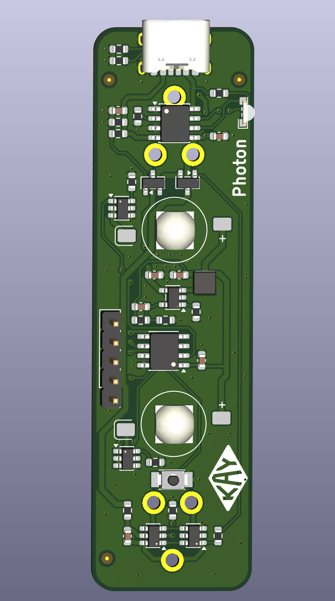
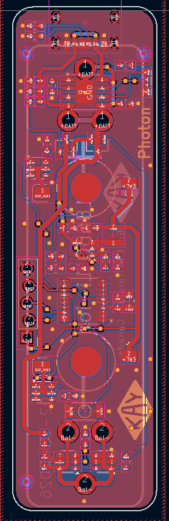

# Photon

## Description
The goal of this project was to create a simple but powerful bike LED light using my remaining 18650 batteries. This is not a weak light, it delivers strong output and can be made even more powerful by swapping two resistors (one per LED) on the current contorl ICs.

A major motivation for this project was to lower the cost of bike lights, as high-quality options are often overpriced for what they offer. I also aimed to reduce labor and assembly costs, since most units would be hand-soldered. This was done by minimizing the number of unique components on the board.

The repository includes the full schematic, PCB layout, manufacturing files, and firmware for the Photon V5 revision, currently working on V6.

## Complete
- Schematic
- Board Design 
- Testing and Validation

## WIP
- Enclosure 
- New STM32 firmware 

## Features
- **Power-Efficient Design**: Utilizes a buck converter and low-power STM32
- **Compact Size**: the board compact roughly the same size as an 18650. 
- **LED Illumination**: 3W High-brightness LEDs with current control ICs.
- **Integrated Battery Charging**: A TP4056 is used for battery charging with a bidirectional side mounted LED for indication
- **Battery Protections**: Undervoltage, overvoltage and short protection is included on the board
- **Charge Detection**: The board will automatically shut off the power to the system if it detects that the board has been plugged in for charging. 
- **Debug Header**: The board uses staggered 2.54 mm header pins that create a spring effect, allowing solderless use similar to a debug header.

## Images
### PCB Front View

### PCB Back View

### Schematic 

## Version
This is version V6 of the Photon project.

## Repository
Hosted on GitHub: [AirMatress/Photon](https://github.com/AirMatress/Photon)